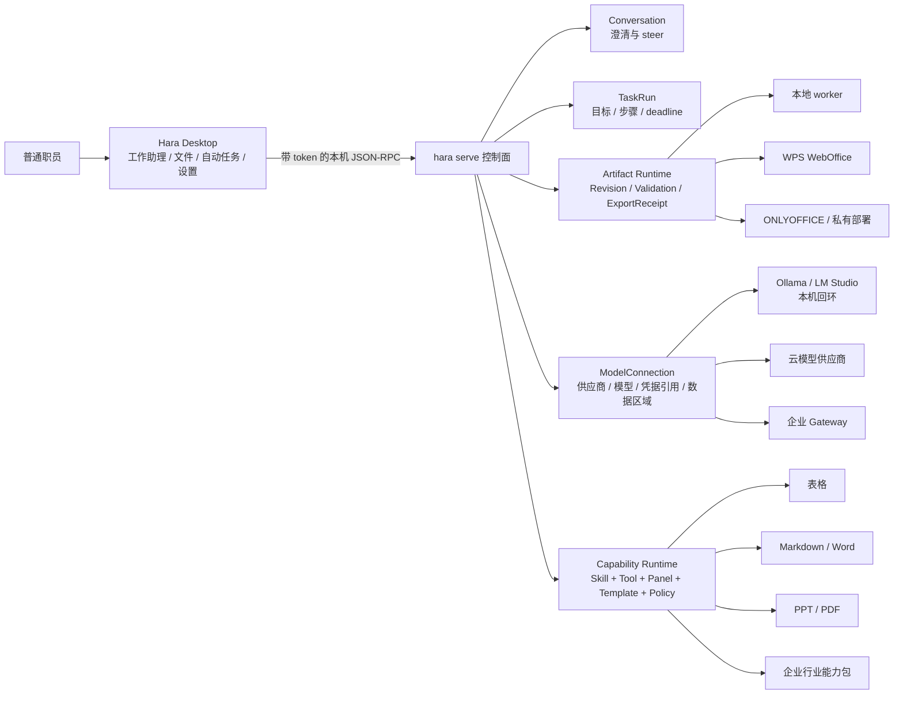

# Hara Desktop 小白工作台与能力中心架构

> 决策日期：2026-07-18
> 状态：分阶段实施。模型供应商控制面与普通语言工作首页已在当前未发布改动中落地；办公 Artifact、能力市场和账号服务仍是规划。
> 目标：在不复制第二套 Agent Runtime 的前提下，把 Hara Desktop 从 coding shell 扩展为普通职员可用的工作助理。

PPT/Slidev 的专项审计、唯一真源、双导出、worker、Panel v2 和模板市场设计见
[`PRESENTATION_CAPABILITY_ARCHITECTURE.md`](./PRESENTATION_CAPABILITY_ARCHITECTURE.md)。

## 1. 不变边界

Hara Desktop 继续是 `hara serve` 的薄客户端：

- Agent loop、TaskRun、Session、Artifact、Tool、权限、市场安装都在 CLI/Serve；
- Desktop 负责工作入口、任务状态、预览、人工编辑、确认、通知和更新；
- renderer 不持有模型密钥、办公 AppSecret 或市场签名私钥；
- Desktop 不通过解析模型自然语言猜测执行状态，只消费结构化事件；
- 能力安装不能扩大已有文件、网络和审批边界。

这是参考 Codex Desktop 最重要的部分。需要学习其 Chat/Work、Goal、Projects、Plugins、Artifact
和 Permissions 结构，不照搬其仓库、终端、worktree 和代码 diff 心智。



官方参考：

- [Work mode](https://learn.chatgpt.com/docs/get-started-with-work)
- [Long-running work](https://learn.chatgpt.com/docs/long-running-work)
- [Projects and chats](https://learn.chatgpt.com/docs/projects)
- [Plugins](https://learn.chatgpt.com/docs/plugins)
- [Work with files](https://learn.chatgpt.com/docs/artifacts-viewer)
- [Permissions](https://learn.chatgpt.com/docs/permission-modes)

## 2. 当前基础与缺口

已有：

- `hara serve` WebSocket JSON-RPC 客户端；
- session create/resume/send/interrupt；
- model、approval、context、compact、rewind、fork；
- 云端、本机和企业托管模型供应商目录；
- `hara serve` 统一管理供应商列表、无持久化连接测试和安全保存；
- Ollama、LM Studio 本机无密钥连接；
- Skill/Plugin 列表和启停；
- project Panel 左右分屏；
- 图片粘贴；
- 自动任务、通知和任务状态桌宠。

缺口：

1. 没有“问一问/帮我做”的双入口；
2. 没有持久 Goal/TaskRun 卡片和结构化步骤；
3. README 声称支持 steer queue，但 `src/client.ts` 尚未暴露 `session.steer`；
4. 没有通用文件附件；
5. 没有 Artifact、Revision、Annotation、Preview、Export 协议；
6. Skill 信息只有 `id/description/source`，不足以构成小白能力卡；
7. 只能列出已安装扩展，没有搜索、安装计划、更新、回滚、隔离和登录；
8. Panel 通过 shell 启动，缺少适合第三方市场的独立 CSP、origin、token 和 capability；
9. Windows Panel 生命周期和 Authenticode 仍是商用发行门槛；
10. 审批只有 question + allow/always/deny，不能清楚说明文件、数据去向和可撤销性。

### 2.1 模型连接控制面

Desktop 的“设置 → 模型与供应商”只调用 `hara serve`，不再保留 Rust 或 renderer 的第二套配置写入器。

当前目录分三类：

| 类型 | 当前连接 |
|---|---|
| 云端 | Anthropic、OpenAI/兼容接口、Qwen、Qwen OAuth、GLM、DeepSeek、OpenRouter |
| 本机 | Ollama、LM Studio |
| 企业托管 | Hara Enterprise Gateway |

边界：

- 本机预设无需伪造 API Key，只允许 `localhost`、`127.0.0.1` 或 `::1`；
- 非本机 HTTP 地址拒绝保存，云端自定义地址必须使用 HTTPS；
- 地址不能携带用户名、密码、query 或 fragment；
- API Key 只在密码框短暂停留，传给 Serve 后写入 Hara 的本机私有状态，接口永不回传；
- 切换供应商且未输入新密钥时，绝不复用上一供应商的扁平密钥；
- 命名 Profile 是供应商、地址和密钥的路由边界，Personal 全局配置不能覆盖它；
- `HARA_*`、启动参数和 `.hara-profile` 固定连接时，Desktop 只读展示并解释解除方式；
- 连接测试最长 12 秒，不保存候选配置，错误返回前统一脱敏；
- 未配置模型时 `hara serve` 仍可启动，并通过 `setupState: needs-credentials` 引导到系统设置；
- 保存只影响新会话，正在执行的会话不热切换供应商。

发布门槛：当前 Desktop `0.1.22` 仍锁定 CLI sidecar `0.124.1`，不具备上述 RPC。这里的源代码改动
不得直接打 Desktop tag。必须先按 CLI 发布流程发布包含 `settings.providers.*` 的版本，再运行
`scripts/refresh-sidecar.sh` 记录该 CLI 的正式 tag 与完整提交，完成打包握手 smoke 后才可发布 Desktop。
安装包始终优先使用内置 sidecar，因此不能用“升级全局 npm CLI”冒充 Desktop 的修复路径。

下一阶段把 `provider + model + endpoint + credentialRef + policy + dataRegion` 收敛为版本化
`ModelConnection`。Session 固定 `connectionId + revision`，管理员更新连接时已有任务继续使用原 revision，
新任务才使用新 revision。密钥再从 CLI 私有文件迁移为平台 Keychain/Credential Manager 的 `secretRef`，
但不得让 renderer 获得读取密钥的能力。

## 3. 用户信息架构

保留现有四场所模型，不增加一排技术入口：

| 场所 | 国内版名称 | 主要对象 |
|---|---|---|
| Chat | 工作助理 | 问一问、帮我做、任务卡、外部渠道 |
| Projects | 我的文件 | 工作文件夹、资料、交付物和版本 |
| Automations | 自动任务 | 定期工作、运行记录、待确认结果 |
| Settings | 设置 | 账号、安全、模型、能力中心、更新 |

“能力中心”同时可从工作助理首页的“添加能力”卡片打开，但不成为普通用户必须先经过的步骤。

首页主入口：

```text
今天想做什么？

[ 问个问题 ]        [ 帮我完成工作 ]

常用：
[做一份表格] [改这份文档] [生成汇报 PPT]
[整理资料]   [设置定期汇报]
```

### 3.1 问一问

- 短回答、解释、改写；
- 默认不建立长期 TaskRun；
- 默认不修改文件；
- 用户随时可转成“帮我做”。

### 3.2 帮我做

Hara 自动把自然语言整理成一张任务简报：

```text
目标：按区域汇总销售明细并生成图表
资料：销售明细.xlsx
交付：可继续编辑的 XLSX
限制：不改原文件、不上传云端
验收：公式无错误，Excel/WPS 可打开
确认点：导出前
```

只追问真正阻断执行的内容，不要求用户学习 prompt 工程。

## 4. 对话与执行分离

Desktop 至少同时展示四种状态：

- Conversation：澄清、解释、steer；
- TaskRun：目标、步骤、进度、deadline、阻断；
- Artifact：当前工作文件和预览；
- Revision：人工或 Agent 的可回退修改。

任务头部固定显示：

```text
正在生成区域汇总  3/5
[暂停] [调整目标] [查看步骤] [取消]
```

到达运行截止时显示：

```text
任务已安全暂停
已保存：区域汇总草稿 v3
原因：本次最长运行时间已到
[继续 15 分钟] [调整要求] [稍后提醒]
```

不能把 timeout 表现成“莫名停止”。

### 4.1 运行中输入

用户发送新消息时，如果当前任务正在运行，显示：

- **现在调整**：通过 `session.steer` + `expectedTurnId` 影响当前任务；
- **完成后再做**：进入可查看、编辑、撤回和排序的队列；
- **新建任务**：独立 TaskRun；
- **只看状态**：侧问，不打断当前任务。

Desktop 不能再把所有输入都调用 `session.send`。

## 5. Artifact 工作台

办公任务采用左右布局：

```text
┌──────────────────────────┬────────────────────────────────────┐
│ 对话、任务简报和进度      │ 表格 / 文档 / PPT / PDF 工作台     │
│                          │                                    │
│ Hara 正在检查公式……      │ 实时预览与人工编辑                 │
│                          │                                    │
├──────────────────────────┴────────────────────────────────────┤
│ 版本 v4  [查看变更] [撤销] [恢复版本] [导出] [替换原文件]     │
└───────────────────────────────────────────────────────────────┘
```

要求：

- Artifact 不是普通聊天附件；
- 每个 Artifact 显示类型、来源、当前 Revision、验证和数据位置；
- 人工编辑与 Agent 编辑进入同一 revision/etag 流；
- 支持选中单元格、图表、段落或页面后发起局部修改；
- 导出按钮绑定确定的 Revision；
- Session rewind 不回滚二进制文件；
- 崩溃后可恢复最后已提交 Revision。

### 5.1 普通职员看到的核心对象

产品首页不要求用户理解“仓库、会话、Agent、Skill”。普通用户只处理：

```text
任务简报 TaskBrief
  ├─ 输入文件 FileRef
  ├─ 执行记录 TaskRun
  └─ 交付物 Artifact
       ├─ 版本 Revision
       ├─ 校验 Validation
       └─ 导出回执 ExportReceipt
```

`ExportReceipt` 至少记录 Artifact/Revision、导出格式、生成器及版本、校验结果、输出文件摘要和时间。
这样“这份表是谁改的、导出的是否是当前版本、为什么 Excel 打不开”都可以追溯。

### 5.2 办公格式技术选型

| 能力 | 本地首选 | 导出 | 明确限制 |
|---|---|---|---|
| 表格 | Univer OSS 编辑器 + 独立计算/导出 worker | CSV；受限 XLSX | OSS 适合表格交互和公式；高保真导入导出、打印、图表、透视表需评估 Univer Pro 或办公 Provider |
| Markdown | Milkdown（ProseMirror/remark） | `.md`、PDF、受限 DOCX | Markdown 是规范源；DOCX 不承诺任意 Word 文件往返不丢版式 |
| Word | `docx` 生成受控模板的新 DOCX | `.docx` | 适合报告、合同草稿、通知等新文档；复杂既有 DOCX 用 WPS/ONLYOFFICE |
| 演示 | Slidev 作为 Web/演讲/PDF 渲染；PptxGenJS 生成受控可编辑 PPTX | PDF、HTML、PPTX | Slidev 的 PPTX 页面是图片，不能称为可编辑交付；可编辑的新 PPTX 走 PptxGenJS 模板 |
| 既有 Office 文件 | WPS WebOffice（国内 SaaS）或 ONLYOFFICE Developer（私有化/全球） | 原生 Office 格式 | 接入前完成授权、数据驻留、回调签名、病毒扫描和真实文件兼容测试 |

首版不做“万能 Office 克隆”。每个能力都声明自己的 fidelity：

- `data-only`：保证单元格值/公式，样式可能降级；
- `template-editable`：由 Hara 模板生成，可继续编辑；
- `visual-fidelity`：保证观看效果，但元素可能不可编辑；
- `roundtrip`：只有通过真实文件语料验收后才能标记。

官方技术参考：

- [Slidev exporting](https://sli.dev/guide/exporting.html)
- [Univer](https://github.com/dream-num/univer)
- [WPS WebOffice 开放平台](https://solution.wps.cn/docs/)
- [ONLYOFFICE DocumentServer](https://github.com/ONLYOFFICE/DocumentServer)
- [PptxGenJS](https://github.com/gitbrent/PptxGenJS)
- [docx](https://github.com/dolanmiu/docx)
- [Milkdown](https://github.com/Milkdown/milkdown)
- [SheetJS CE write options](https://docs.sheetjs.com/docs/api/write-options/)

### 5.3 文件数据路径

每个编辑器、任务简报和行动卡都显示同一套数据路径：

| 路径 | 用户可见说明 |
|---|---|
| 本地文件 + 本地模型 + 本地 worker | 文件与模型请求都不离开电脑 |
| 本地文件 + 云模型 | 只把本任务选择的内容发送给当前模型供应商 |
| WPS/其他在线 Office | 文件会上传到该办公服务，显示区域、保存期限和删除入口 |
| 企业私有部署 | 文件发送到企业配置的内网地址，由企业策略管理 |

默认不执行宏、不自动刷新外部链接、不上传整个目录。覆盖原文件、发给他人、发布链接和跨境发送必须是
结构化重要动作，不能藏在 Skill Prompt 里。

## 6. Serve Protocol v2 需求

Desktop 不实现这些逻辑，只增加 client bindings 和 UI。

### 6.1 方法

```text
task.get
task.pause
task.resume
task.update
session.steer
queue.list
queue.update
queue.remove

artifact.import
artifact.list
artifact.get
artifact.revisions
artifact.commit
artifact.revert
artifact.export

capability.catalog
capability.package.get
capability.install.plan
capability.install.apply
capability.update.plan
capability.update.apply
capability.rollback
capability.remove.plan
capability.remove.apply
capability.permissions

panel.open
panel.close
```

### 6.2 事件

```text
event.task_progress
event.task_waiting
event.queue_changed
event.artifact_created
event.artifact_changed
event.artifact_preview
event.validation
event.export_ready
event.capability_progress
approval.request.v2
```

客户端继续通过 `initialize.capabilities.methods` 做 feature negotiation；老 sidecar 缺方法时显示升级指引，
不长期维护两套复杂兼容分支。

## 7. 能力中心

默认栏目：

- 官方精选；
- 办公；
- 设计与视频；
- 企业内部；
- 个人创建；
- 已安装；
- 更新。

能力卡只展示：

- 能做什么；
- 需要什么资料；
- 产生什么文件；
- 会读取/修改什么；
- 数据是否离开电脑；
- 是否收费。

详情的“高级信息”才展示组件、权限、发布者、版本、digest、签名、SBOM 和兼容范围。

安装必须先调用 `capability.install.plan`。UI 只能提交绑定 package digest 与 permission hash 的一次性
`planId`，避免“显示 A、安装 B”。

首版只安装 Hara 官方签名能力，不开放第三方 executable/MCP/native Panel。

### 7.1 能力包，而不是 Prompt 包

一个办公能力包是下面五部分的不可分割版本：

```text
CapabilityPackage
  ├─ Skill       任务理解、步骤和质量标准
  ├─ Tool        确定性读取、计算、校验和导出
  ├─ Panel       人工预览与局部编辑
  ├─ Template    行业交付格式、示例和品牌变量
  └─ Policy      文件范围、网络目的地、审批和数据区域
```

Agent 可以自动发现并建议能力，但不能因为 Prompt 写了“调用财务助手”就绕过安装、权限和签名。
能力的激活由任务意图、文件 MIME/扩展名、显式用户选择和企业策略共同决定；真正执行前仍走工具权限管道。

首批能力组合：

1. 表格整理：清洗、公式、汇总、图表、校验和 XLSX/CSV 导出；
2. 周报与经营汇报：资料归集、Markdown 主稿、DOCX 与 PPT 双交付；
3. 会议纪要：录音/文字输入、行动项、负责人、可编辑 Word；
4. 销售与运营：客户清单、区域分析、活动复盘；
5. 人事行政：通知、招聘汇总、排班和培训材料；
6. 企业内部包：品牌模板、术语、审批流、内部数据连接器。

财务、法务、人事等行业包必须把规则计算放进可测试 Tool，把语言说明放进 Skill；不能只依赖角色 Prompt。

### 7.2 市场供应链

现有 Plugin/Panel 安装器不适合直接开放第三方可执行市场。P0 只接受 Hara 官方签名包，并逐步补齐：

- 规范化 manifest、内容 digest、Ed25519 签名和发布者身份；
- 安装计划绑定 package digest 与 permission hash；
- 下载到不可变缓存，校验后原子激活；
- 安装 receipt、版本 pin、撤回名单和一键回滚；
- Panel 独立 origin/CSP/token/capability；
- MCP/native/外部命令按风险单独审核；
- 企业私有目录只能分发管理员签名且组织策略允许的包。

在这些门槛完成前，“上传一个 zip 就上架”必须被拒绝。

## 8. 行动卡

`approval.request.v2` 应返回结构化字段：

```text
title
summary
reason
resource
effect
dataDestination
reversible
risk
choices
expiresAt
```

示例：

```text
读取“销售明细.xlsx”

用途：生成区域汇总
范围：你选择的这一份文件
数据：抽样内容会发送给当前云模型
修改：只创建本地副本，不改原文件

[仅这次允许] [本任务允许] [拒绝]
```

重要动作：

- 覆盖原文件；
- 上传云端；
- 分享/发送；
- 执行宏；
- 刷新外部链接；
- 安装或更新高风险能力；
- 扩大文件或网络范围。

创建可撤销草稿不应每一步弹窗。

## 9. Panel v2

当前 `start_panel` 不能成为开放市场运行器。Panel v2：

- 不拼 shell，不从任意 PATH 解析命令；
- entrypoint 必须位于不可变 package root 并绑定 digest；
- 独立 WebviewWindow 和最小 Tauri capability；
- 默认拒绝 CSP；
- 严格解析 loopback 或签名 allowlist origin；
- 随机端口、一次性 token、短 TTL；
- 版本化 Artifact bridge；
- 禁止任意导航和直接 Tauri invoke；
- 文件操作回到 `hara serve`；
- macOS/Linux 使用进程组，Windows 使用 Job Object；
- app 退出、包撤回或权限失效时终止 owned process。

内置官方 Panel 也走同一协议，避免市场版形成第二条旁路。

## 10. Windows 商用门槛

国内普通职员以 Windows 为主。进入公开商用试点前必须：

- MSI/NSIS 或 MSIX 完成 Authenticode 和 timestamp；
- 内置 sidecar、Office worker 和 updater 分别验证签名；
- Windows 原生 Panel lifecycle；
- 中文用户名、空格、长路径、文件锁、网络盘测试；
- WebView2 缺失/损坏的可理解修复指引；
- 安装、更新、回滚和卸载 smoke；
- SmartScreen 实际验证；
- 企业静默安装与版本 pin 方案。

没有 Authenticode 时不能宣称“Windows 无安全警告”。

### 10.1 国内版与全球版

保持一套开源 Runtime/协议和一套 Desktop 基础客户端，避免国内外形成两个不可维护分支。商业差异放在服务控制面：

| 层 | 国内版 | 全球版 |
|---|---|---|
| 账号、计费、组织 | 国内独立服务与数据存储 | 全球独立服务与数据存储 |
| 模型目录 | 国内可用供应商、本地模型、企业网关 | 全球供应商、本地模型、企业网关 |
| Office Provider | 优先 WPS WebOffice/企业私有部署 | 优先 ONLYOFFICE/企业私有部署 |
| 能力目录 | 国内审核、中文模板、国内结算 | 全球审核、国际模板和结算 |
| 遥测与 Artifact | 默认区域内，不做隐式跨境 | 默认区域内，不做隐式跨境 |

建议继续开源 `hara-cli`、协议、基础 Desktop 和官方能力 SDK；把账号、计费、企业策略、签名市场、
托管同步、审计和 SLA 作为商业服务。闭源整个 Desktop 不会自动保护商业价值，反而会降低本地模型、
文件边界和企业部署的可验证性。

## 11. 实施顺序

### P0-A：执行状态

- Task/Goal 卡；
- `session.steer` client；
- 队列查看、编辑和撤回；
- deadline/pause/resume 友好状态；
- task/session 恢复 UI。

### P0-B：文件与 Artifact

- 通用附件；
- Artifact/Revision/Export；
- preview/validation 事件；
- 行动卡 v2；
- 本地副本与替换原文件确认。

### P0-C：Panel 与市场安全

- Panel v2；
- Windows lifecycle；
- CSP/capability/origin/token；
- 签名 package 的 install plan；
- 能力中心官方精选。

### P0-D：表格助手

- Univer 表格 Panel；
- CSV + 受限 XLSX worker；
- 版本、变更、校验和导出；
- 小白任务模板；
- 至少 10 名非技术用户可用性测试。

### P0-E：模型连接

- ✅ Serve 供应商目录、测试与保存控制面；
- ✅ Desktop 系统设置；
- ✅ Ollama/LM Studio 本机无密钥连接；
- ✅ 命名 Profile 路由隔离、密钥不回显和地址边界；
- ModelConnection revision 与 Session 固定；
- macOS Keychain / Windows Credential Manager / Linux secret service；
- Qwen OAuth 从 Desktop 发起并回到连接页。

### P1

- 国内登录和 entitlement；
- WPS WebOffice Provider 与真实文件兼容评估；
- 云 Artifact 和协作；
- Milkdown + DOCX 报告能力；
- Slidev 预览/PDF + PptxGenJS 可编辑模板能力；
- ONLYOFFICE Developer 私有化 PoC；
- 企业内部目录。

### P2

- 第三方发布者审核和收费市场；
- 多人实时共同编辑；
- 高保真既有 PPTX/DOCX roundtrip；
- 按行业认证的财务、法务和人事能力包。

## 12. 验收

- 默认界面不出现 MCP、cwd、JSON、Skill ID 或 shell 错误；
- 80% 未培训用户完成“选文件—一句话—预览—导出”；
- 100% 测试用户能找到暂停、撤销和导出；
- timeout 明确说明原因和恢复方式；
- 人工/Agent 并发修改不静默覆盖；
- Panel 无主窗口 Tauri 权限；
- Windows/macOS/Linux 安装和 Panel 退出均无孤儿进程；
- 低版本 sidecar 给出明确升级命令。
- 用 30–50 份脱敏真实中文业务文件建立格式语料库，逐格式记录打开、编辑、保存、再打开结果；
- Excel/WPS 公式错误、截断、日期/货币类型和外部链接都有确定性校验；
- PPTX 标明“可编辑”或“视觉稿”，不能以文件扩展名代替能力承诺；
- DOCX/PPTX/XLSX 导出均产生绑定 Revision 的 ExportReceipt；
- 本地模型连接在 Ollama/LM Studio 未启动、无模型和超时时给出可执行修复建议。
