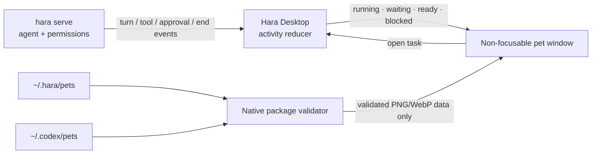

# Hara Desktop pets

## What we learned from Codex

Codex treats a pet as an optional task-status surface, not as agent logic. The desktop overlay can
follow several tasks, gives priority to work that needs human input, and never changes how the model
executes a task. Custom pets are local sprite packages. The public formats share 192 × 208 cells and
eight columns:

| Format | Atlas | Rows |
| --- | --- | --- |
| v1 | 1536 × 1872 | nine standard animation rows |
| v2 | 1536 × 2288 | the v1 rows plus sixteen look directions |

The standard state rows Hara consumes are idle (0), blocked (5), needs-input (6), running (7), and
ready (8). Movement uses rows 1 and 2. Hara accepts both formats but does not bundle, upload, or copy
Codex artwork.

## Hara boundary

- `hara serve` remains the only owner of agent execution and approvals.
- Desktop derives a bounded semantic activity map. It never parses model prose to guess state.
- Priority is needs input, blocked, ready, then running; newest wins ties.
- The overlay starts with `focus: false` and `focusable: false`, so merely showing or moving it cannot
  take keyboard focus from the composer or another application.
- Reduced-motion mode holds the first frame rather than running the atlas animation.

## Package security

Pet packages contain metadata and one image only. Hara does not load scripts, HTML, CSS, commands, or
plugins from them. Native validation enforces:

- a fixed root (`~/.hara/pets` or the read-only compatibility root `~/.codex/pets`);
- one real child directory, with no selector path traversal or symlink package;
- `spritesheetPath` confined to that package, including canonical-path and symlink checks;
- a regular PNG or WebP no larger than 20 MiB;
- an exact v1/v2 geometry and a matching declared sprite version;
- bounded display metadata before it crosses into the renderer.

The pet webview receives a validated data URL, not filesystem permission or an arbitrary local path.

## Market roadmap

The local package contract is the first layer of a future Hara skill/pet market:

1. Local catalog (implemented): built-in Hara pet plus safe Hara/Codex v1/v2 discovery.
2. Explicit install/import: stage to a temporary directory, validate, hash, and atomically rename into
   `~/.hara/pets/<id>`; never execute package content.
3. Open marketplace metadata: author, license, provenance, preview, SHA-256, format compatibility, and
   minimum Desktop version. A signed index authenticates listings; the asset hash authenticates bytes.
4. Creation workflow: publish a Hara-compatible pet-generation skill that produces the same v2 atlas,
   validation report, and manifest. Generated assets remain local unless the user explicitly publishes.
5. Shared surfaces: Desktop gets the multi-task activity tray; CLI may render compatible pets only when
   its terminal image protocol supports them. Neither surface owns task execution.

Remote install links should require HTTPS, an allowlisted manifest schema, bounded redirects and bytes,
content decoding, hash verification, and atomic installation. A marketplace entry is data, never a way
to grant a pet executable capability.
