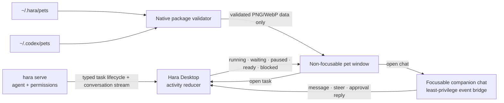
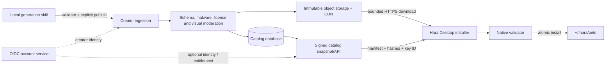

# Hara Desktop pets

## What we learned from Codex

Codex treats a pet as an optional task-status surface, not as agent logic. The desktop overlay can
follow several tasks, gives priority to work that needs human input, and never changes how the model
executes a task. Custom pets are local sprite packages. The public formats share 192 × 208 cells and
eight columns:

| Format | Atlas | Rows |
| --- | --- | --- |
| v1 | 1536 × 1872 | nine standard animation rows |
| v2 | 1536 × 2288 | the v1 rows plus sixteen look directions |

The standard state rows Hara consumes are idle (0), blocked (5), needs-input (6), running (7), and
ready (8). Movement uses rows 1 and 2. Hara accepts both formats but does not bundle, upload, or copy
Codex artwork.

## Hara boundary

- `hara serve` remains the only owner of agent execution and approvals.
- Desktop derives a bounded semantic activity map. It never parses model prose to guess state.
- Priority is needs input, blocked, paused, ready, then running; newest wins ties.
- The overlay starts with `focus: false` and `focusable: false`, so merely showing or moving it cannot
  take keyboard focus from the composer or another application.
- Chat opens in a separate focusable window. That webview has only Tauri event/window permissions,
  and the production build injects `connect-src 'none'` plus a deny-by-default CSP into its dedicated
  `pet-chat.html`. Native capabilities and browser networking are therefore separate enforced
  boundaries: it cannot invoke native commands, read files, open a fetch/WebSocket/beacon channel,
  reach the model, install capabilities, or answer an approval by itself. The trusted main renderer
  validates the pinned target session and forwards work to `hara serve`. Development builds omit this
  production CSP so Vite HMR can operate.
- The companion pins the session selected when it opens. A new high-priority background activity can
  change the pet badge but cannot silently redirect text typed into an already-open chat. Requests
  carrying a stale target are rejected, and switching targets clears the old draft and pending request.
- Each chat request has a finite slow-response threshold. A definitive bridge failure restores unsent
  draft text without overwriting a newer draft. Crossing the threshold alone keeps the one request
  pending and disables resend because the trusted main renderer may already be dispatching it; a slow
  acknowledgement can never become a duplicate task. Queued follow-ups and attachments stay together
  and can be retried or cancelled before execution. A persisted session is resumed before the first
  cold-start send, and a BUSY requeue preserves FIFO ordering.
- Current engines supply typed task lifecycle state. The legacy projection still maps bounded
  running/completion state and unanswered approval events while a turn is live; turn end expires those
  controls so an old approval cannot be replayed.
- Reduced-motion mode holds the first frame rather than running the atlas animation.

## Package security

Pet packages contain metadata and one image only. Hara does not load scripts, HTML, CSS, commands, or
plugins from them. Native validation enforces:

- a fixed root (`~/.hara/pets` or the read-only compatibility root `~/.codex/pets`);
- one real child directory, with no selector path traversal or symlink package;
- `spritesheetPath` confined to that package, including canonical-path and symlink checks;
- a regular PNG or WebP no larger than 20 MiB;
- an exact v1/v2 geometry and a matching declared sprite version;
- bounded display metadata before it crosses into the renderer.

The pet webview receives a validated data URL, not filesystem permission or an arbitrary local path.

## Product ownership and compatibility

Hara owns `~/.hara/pets`. The Codex root is a read-only compatibility/import source, not Hara's
long-term registry and never a write target. A future installer must copy an explicitly selected and
license-compatible package through Hara's validator into its own root. Hara must not upload, mutate,
or silently claim ownership of a Codex package.

The client should introduce a source-neutral `PetProvider` boundary before adding a remote catalog:

- `builtin`: the code-native Hara companion;
- `hara-local`: installed or locally generated packages under `~/.hara/pets`;
- `codex-local`: read-only compatibility discovery under `~/.codex/pets`;
- `hara-market`: signed remote metadata whose downloaded bytes are installed into `hara-local`.

Selectors stored in user settings are opaque, provider-qualified logical IDs. Filesystem paths and
CDN URLs are never selectors. An explicit Codex-to-Hara import creates a new `hara` selector only
after validation rather than silently remapping the existing read-only selector.

## Generation contract

The first Hara generator should be a local skill, not a server dependency. It produces a v2 package
containing only:

- `pet.json` with stable ID, display name, author, semantic version, sprite format, minimum Hara
  version, license, and provenance declarations;
- the exact 1536 × 2288 atlas with all nine standard animation rows and sixteen look directions;
- a bounded preview image plus a machine-readable validation report containing image dimensions and
  SHA-256 values.

Generation defaults to private and local. Publishing is a separate, explicit operation with a final
preview, license/provenance confirmation, and moderation result. The generation skill may use local or
remote image models, but API credentials stay in Hara's credential boundary and never enter the pet
package. A hosted generation worker is useful only after Hara needs cross-device generation, quotas,
billing, or centrally enforced safety policy.

## Marketplace architecture

The minimum service is deliberately small:

1. Immutable object storage and a CDN for atlases, previews, and manifests.
2. A public read-only catalog API or versioned static snapshot.
3. An offline/CI-controlled Ed25519 catalog signer. Entries bind package ID, version, byte length,
   SHA-256, compatibility, and asset URLs; clients ship trusted public keys and support key rotation.
4. A creator-ingestion worker that unpacks into an isolated temporary area, rejects links and extra
   executable content, runs the same native geometry/schema validator, and queues license and visual
   moderation before publication.
5. A small catalog database for publishers, pets, immutable versions, moderation state, and optional
   entitlements. Install state remains local and need not be tracked by the server.

Remote installation is always: fetch signed metadata, enforce HTTPS and bounded redirects/bytes,
download to a staging directory, verify length and SHA-256, validate schema and image dimensions,
then atomically rename into `~/.hara/pets/<id>`. Failed updates preserve the last valid version. A
marketplace package is inert data and can never grant scripts, tools, commands, HTML, or plugin
permissions.

## Login boundary

Login is not a prerequisite for the first marketplace release. Browsing, installing free public pets,
local generation, import, uninstall, and update checks should work without an account. This keeps the
first server surface cacheable and avoids coupling the pet overlay to service availability.

Add accounts only for a concrete identity-bearing feature:

- creator publishing and ownership;
- paid/private entitlements;
- ratings, favourites, or cross-device library sync;
- hosted generation quotas or billing.

Desktop authentication should use an external browser with OAuth/OIDC authorization code + PKCE (or
device authorization where deep links are unavailable). Access and refresh tokens belong in the OS
credential store, never localStorage, a project file, `.env`, logs, or chat. The pet renderer receives
no token; only the main trusted process talks to the account/catalog service. Logout revokes tokens but
does not silently delete locally installed public packages.

## Delivery phases

1. **Local foundation (current):** built-in Hara pet, validated Hara/Codex v1/v2 discovery, typed task
   states, and a least-privilege companion chat for messages, steering, and one-time approvals.
2. **Independent creation:** publish the Hara v2 generation/validation skill and explicit local import;
   add install receipts (`source`, version, hashes, license) without adding an account.
3. **Open market:** signed public catalog, CDN downloads, atomic install/update/rollback, no login.
4. **Creator accounts:** OIDC/PKCE, submission, provenance and moderation console.
5. **Entitlements and sync:** introduce login for paid/private content or cross-device state only when
   those product requirements exist.

CLI may render compatible pets only when its terminal image protocol supports them. Desktop, CLI, the
market, and the generator all consume the same package contract; none of them owns or changes agent
execution.
