# ppt-master 审计与 Hara Presentation 导入方案

> 决策日期：2026-07-19
> 审计对象：`ppt-master` 本地提交 `bb384ab6`，上游
> `https://github.com/hugohe3/ppt-master.git`
> 状态：架构审计完成，尚未复制代码、模板或创建独立 PPT 仓库。

## 1. 结论

可以用 `ppt-master` 补强 Hara 的“上传资料后生成 PPT”能力，但它不是一个可以直接嵌进
Desktop 的上传应用，也不应作为运行时 Git 依赖整库安装。

建议：

- 保留 `PresentationProject` 作为 Hara 演示文稿的唯一真源；
- 借鉴 `ppt-master` 的源文件归一化、四类任务路由、母版结构、原生 PPTX 导出和质量门禁；
- 对确有价值的 MIT 代码做逐文件许可审计后，固定版本并迁入官方签名 worker；
- 由 `hara serve` 负责文件导入、权限、隔离、任务状态、Artifact Revision 和导出回执；
- Desktop 只提供普通用户能理解的“选择资料—确认大纲—预览—修改—导出”界面；
- 继续让 Slidev 负责演示网页、PDF 和视觉保真输出；以经过审计的原生导出器补足
  `template-editable` PPTX；
- 不发布带任意脚本的第三方 PPT 插件市场，先完成 Artifact、Panel v2、签名和 worker
  隔离。

这不是替换现有方案，而是把“可编辑 PPTX”和“多格式资料导入”从规划推进到有明确候选
实现的阶段。

## 2. 当前 GitHub 发布状态

截至本次审计：

| 项目 | GitHub 状态 | 已有内容 |
|---|---|---|
| `hara-desktop` | 已发布 | 普通用户工作台入口与 Presentation/Office 架构文档 |
| `hara-design` | 已发布 | HTML 演示设计 Skill、主题和参考模板 |
| `hara-presentation` | 不存在 | 尚未形成可安装、可发布的独立能力包 |
| `hara-office` | 不存在 | 仍受 ADR、许可、安全和 conformance 门禁约束 |

因此，“刚刚规划的 PPT 插件”目前**没有作为独立插件发布到 GitHub**。不能向用户宣称已经
可以安装 `@nanhara/hara-presentation`。现阶段 GitHub 上的是产品入口、参考能力和架构方案。

## 3. ppt-master 实际提供了什么

`ppt-master` 是约 1.5 GB 的 Skill、脚本、模板和示例集合。根许可证是 MIT，当前插件清单
版本为 2.7.0。它的核心不是上传 UI，而是以下四条互斥路线：

1. 根据 PDF、DOCX、XLSX、PPTX、Markdown、网页等资料生成新演示文稿；
2. 从现有 PPTX 或品牌资料创建可复用模板；
3. 把新内容填入原生 PPTX 模板；
4. 为已有原生 PPTX 增加备注、配音、动画等增强信息。

其生成主链路是：

```text
源资料
→ 创建隔离项目
→ 选择明确模板（可选）
→ 形成策略、大纲与视觉方向
→ 用户确认
→ 按页顺序生成 SVG
→ 页面与整稿质量检查
→ 写入备注
→ SVG 终处理
→ 原生 PPTX 导出
```

源文件分发器已有明确的格式适配：

| 输入 | 上游处理器 | Hara 第一阶段建议 |
|---|---|---|
| Markdown / 文本 | 直接归一化 | 支持 |
| PDF | PDF → Markdown/资产 | 支持，限制页数与解压后大小 |
| DOCX | Word → Markdown/资产 | 支持，拒绝外部关系和宏执行 |
| XLSX | 表格 → Markdown/结构数据 | 支持，公式只作数据读取 |
| PPTX | 页面、备注和资产提取 | 支持“生成新稿”与“填充模板”两个意图 |
| HTML / URL | 网络抓取与转换 | 后置；必须单独申请网络权限 |
| 旧 Office、EPUB、LaTeX 等 | 可选工具链 | 不进入首发承诺 |

其 SVG → PPTX 路径能把受支持的文本、图形、图片、表格和图表转换成 DrawingML，而不是
简单把整页截图塞进 PPTX。这使它适合作为首个 `template-editable` exporter 候选。

## 4. Hara 的上传生成链路

“上传”不能只是把桌面路径交给 Python 脚本。正确链路是：

```mermaid
flowchart LR
    U[Desktop 选择文件] --> I[hara serve artifact.import]
    I --> S[不可变 staging 副本<br/>SHA-256 / MIME / 大小]
    S --> G[安全检查<br/>宏 / OOXML 关系 / zip bomb / 路径]
    G --> N[Source Adapter<br/>归一化文本、表格、页面和资产]
    N --> B[Presentation Brief<br/>受众 / 目标 / 页数 / 交付]
    B --> R[意图路由<br/>生成 / 填充 / 增强 / 建模板]
    R --> C[用户确认大纲与视觉方向]
    C --> P[PresentationProject Revision]
    P --> W[签名隔离 Worker<br/>顺序制页 / 导出]
    W --> V[重开 / 快照 / contact sheet / 校验]
    V --> E[ExportReceipt]
```



硬边界：

- 原始文件永不被移动、改名或覆盖；先复制到 Artifact staging，再处理副本；
- 上游工作流要求的 `import-sources --move` 只能作用于 staging 内部，不能作用于用户路径；
- converter 的输出必须显式写入 Artifact 工作目录，不能默认写到源文件旁边；
- worker 只收到 opaque input id 和受限挂载，不收到任意全盘路径；
- URL 导入先走宿主的 `resource.acquire`，由用户批准网络、域名和下载大小；
- 宏文件默认隔离，绝不执行 VBA、嵌入对象或 Office 外部关系；
- 导出写入私有临时文件，重开校验通过后再原子移动到用户批准的位置；
- 覆盖已有文件、读取额外目录和新增网络访问分别审批。

普通用户不需要理解上述四条技术路线。界面只在意图不清时问一个问题，例如：
“你想按这份 PPT 的样式制作新内容，还是改进这份 PPT 本身？”

## 5. 可复用、需改造与禁止直接引入

| 上游能力 | 决策 | Hara 处理 |
|---|---|---|
| `source_to_md` 分发思路 | 复用设计 | 改成 `SourceAdapter` 接口，输出稳定 schema |
| PDF/DOCX/XLSX/PPTX 转换器 | 有条件迁入 | 固定依赖、限制资源、加恶意 fixture |
| SVG → 原生 PPTX | 优先 spike | 包成无模型、默认断网的签名 worker |
| 生成/填充/增强/建模板路由 | 复用 | 路由成为任务元数据，不暴露脚本路径 |
| 首屏确认、逐页生成、终检 | 复用 | 映射成 Hara checkpoint 和 ValidationReport |
| `confirm_ui` / `svg_editor` 本地服务 | 不直接使用 | 改成 Panel v2 + Artifact bridge |
| Python `>=` 依赖与用户手装 | 不接受 | 锁精确版本，随平台签名能力包交付 |
| Node、Chromium、Pandoc 等 PATH 探测 | 不接受 | 绝对路径启动受控 runtime，声明可选能力 |
| 图片搜索、AI 图片、URL、TTS 网络调用 | 不直接使用 | 回到 Hara 权限、凭据和数据区域管道 |
| 整库 Git 依赖或运行时 clone | 不接受 | 只迁入审计过的最小代码和资产 |
| 任意 SVG/JS/CSS 模板 | 不进入小白市场 | 转成受限 Component DSL 或预先栅格化 |

上游页面生成明确采用主 Agent 顺序制页。这一点适合 PPT：先锁定首屏和设计语言，再逐页完成，
比多个 Agent 同时改同一稿稳定。可以并行的是只读资料提取、图片候选获取和最终 reviewer，
不是对同一 `PresentationProject` 的并发写入。

## 6. 模板与素材边界

根 MIT 许可证允许在保留许可与版权声明的前提下复用代码，但不自动授予第三方商标、Logo、
字体、照片或示例内容的使用权。

本次模板快照包括：

- 一个通用 `presentation_core` 结构模板，含 20 类 16:9 原生布局；
- 两个企业整稿模板；
- 五组品牌包；
- 大量图表、图标、示例 PPTX 和示例图片。

处理建议：

| 资产 | 决策 |
|---|---|
| `presentation_core` 的布局分类与约束 | 优先参考，重绘成 Hara 基础模板并保留上游 NOTICE |
| 通用图表、流程图和信息图结构 | 逐项审计后转成 Hara Component DSL |
| 企业品牌包、Logo、wordmark、企业整稿 | 不放进公开市场；只学习结构 |
| 示例 PPTX、照片和抓取图片 | 只作本地测试参考，来源不明前不再分发 |
| 图标库 | 补齐每个上游库的 SPDX/NOTICE 后按需引入，不能整目录复制 |
| Simple Icons 等商标图标 | 保留商标声明，不作为 Hara 自有品牌素材 |
| 字体 | 逐个记录授权和可嵌入性；系统字体只作 fallback，不打包 |

Hara 模板包最终必须包含：

```text
template.json
layout/component schema
design contract
tokens
licensed assets/fonts
thumbnails
sample PresentationProject
SPDX / NOTICE / provenance
file digests
publisher signature
```

模板选择可以对用户表现为缩略图市场，但内部必须解析成明确的
`template id + version + digest`，不能依靠模糊名称或工作区路径。

## 7. 推荐的代码落点

不再新建一个与 Office 方案重叠的孤立仓库。完成前置门禁后，建议放入规划中的公开
`hara-office`：

```text
hara-office/
  capabilities/presentation/
    adapters/source/
    exporters/pptx-editable/
    validators/
    panel/
    templates/base/
  packages/office-schema/
  packages/worker-sdk/
  packages/conformance/
  THIRD_PARTY_NOTICES
```

职责保持清楚：

- `hara-design`：HTML 原型、演示设计语言和高级设计 Skill；
- `hara-office/capabilities/presentation`：结构化资料导入、Artifact、可编辑导出和校验；
- Slidev adapter：HTML、PDF、演讲和 `pptx-visual`；
- ppt-master adapter：源文件归一化与 `pptx-editable` 候选实现；
- `hara-desktop`：普通用户任务入口、确认、预览、修改与导出；
- `hara-cli` / Serve：文件、权限、任务、进程、版本和回执的唯一安全边界。

官方包不能要求 Windows 用户自行安装 Python、Node、Chromium 或 Pandoc。第一阶段可发布
固定 Python runtime 的平台 worker；通过 conformance 后，再判断是否把关键 exporter
逐步移植到 TypeScript/Rust。

## 8. 实施顺序

### 阶段 A：许可与协议 spike

1. 固定上游提交并生成逐文件来源清单；
2. 完成 MIT NOTICE、图标、字体、Logo 和示例资产审计；
3. 定义 `SourceDocument`、`PresentationProject`、`ValidationReport` 和
   `ExportReceipt` schema；
4. 定义 `artifact.import`、输入挂载、取消、超时与 worker JSONL 协议；
5. 用一份 DOCX、一份 PDF、一份 XLSX 和一份 PPTX 做只读 spike。

### 阶段 B：首个纵向切片

1. Desktop 选择本地资料；
2. Serve 建立不可变 Artifact 输入；
3. adapter 归一化资料；
4. Agent 生成 brief、大纲和视觉方向并等待确认；
5. 生成 5–10 页受限 `PresentationProject`；
6. 同时导出 PDF、`pptx-visual` 和 `pptx-editable`；
7. 重开、渲染、contact sheet、差异和回执全部通过。

### 阶段 C：官方基础模板

1. 重绘 `presentation_core` 的通用布局体系；
2. 只引入许可清楚的图标与图表组件；
3. 建立模板锁、升级迁移、视觉快照和跨平台字体测试；
4. 先随官方能力包发布，不开放第三方可执行内容。

### 阶段 D：市场

完成 manifest v2、签名、digest、receipt、回滚、Panel v2、企业策略和恶意包测试后，才开放
模板发布。模板内容包与 executable worker 必须分级审核。

## 9. 必须通过的 conformance

- 路径穿越、符号链接、OOXML 外部关系、宏、嵌入对象和 zip bomb；
- 超大页数、超大图片、损坏字体、损坏 Office、错误 MIME 和扩展名伪装；
- 网络默认拒绝、环境变量与凭据不继承、临时目录不泄漏；
- 取消、超时、崩溃后完整进程树退出，Windows 无孤儿进程；
- macOS、Windows 和 Linux 固定 runtime 生成结果可重现；
- PowerPoint、WPS 和 LibreOffice 重开，页数、画布、缩略图和基础可编辑对象正确；
- 原文件摘要始终不变，导出失败仍保留最后可恢复 Revision；
- 任一模板和素材都能追溯许可证、来源、digest 和使用范围。

在这些门禁通过前，只能称为“实验性本机能力”，不能发布为普通用户可安装的正式 PPT 插件。
