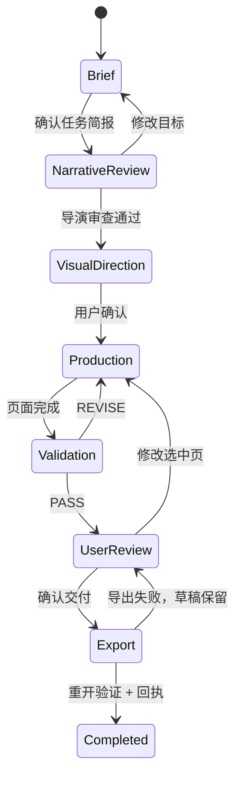
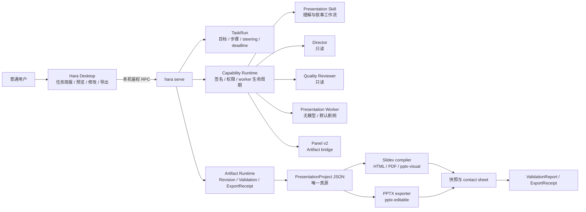

# Hara Presentation 能力包与普通用户桌面工作流

> 决策日期：2026-07-18
> 状态：架构确定，Desktop 第一阶段入口已开始实施；`hara-office` 仓库及其中的
> Presentation 能力包尚未创建。
> 本地参考：`/Users/zhujianbo/work/projects/slidev`（只读审计，保留其现有未提交改动）。
> 补充审计：[`PPT_MASTER_INTEGRATION_AUDIT.md`](./PPT_MASTER_INTEGRATION_AUDIT.md)
> 记录多格式资料导入、原生 PPTX exporter 候选和模板许可边界。

## 1. 结论

可以参考本地 Slidev 做成 Hara 的官方 PPT 能力，但不能把整个 Slidev 仓库、`pnpm start`
或 Markdown 编辑器直接包进 Desktop。

正确分工：

- `PresentationProject` 是普通模式的唯一真源；
- Slidev 是 HTML、演讲、PDF 和视觉保真 PPTX 的渲染器；
- 可编辑 PPTX 从同一语义化页面模型独立生成；
- Hara CLI/Serve 管任务、文件边界、版本、校验、worker 和导出；
- Desktop 管普通用户入口、任务简报、页纲确认、预览、局部修改和导出；
- Skill 和主 Agent 负责理解、叙事与选择；确定性 worker 负责转换与校验；
- 两个只读 reviewer 只给出 `PASS` 或 `REVISE`，不直接修改或导出。

规划中的 Presentation 能力包第一版只承诺（当前 Desktop 卡片只是任务入口，不等于这些
exporter 已可用）：

| 交付 | 实现 | 承诺 |
|---|---|---|
| 演示网页 | Slidev | 可播放、可分享受控静态稿 |
| PDF | Slidev/Chromium | 视觉一致、适合发送和打印 |
| 视觉保真 PPTX | Slidev 图片页 | 页面外观一致，文字和图形不可编辑 |
| 可编辑 PPTX | 语义模型 → 独立 exporter | 受控模板内可编辑，不承诺任意 PPTX 往返 |

文件扩展名不能代替产品承诺。任何导出界面都必须显示
`visual-fidelity`、`template-editable` 或未来真实验收后的 `roundtrip`。

## 2. 本地 Slidev 审计

### 2.1 可以抽取

- `addon-nanhara/`：设计 token、7 个布局和离线 SVG/CSS 信息图组件；
- `templates/design_spec.md`：用途、受众、叙事模式、脱敏边界和页纲；
- `DESIGN_SYSTEM.md`：`pyramid`、`narrative`、`instructional`、`showcase`、
  `briefing` 五种叙事模式；
- `scripts/check.js`：逐页展开 click state 后检查溢出、未解析组件和运行错误；
- `scripts/export.js`：已经正确说明 Slidev PPTX 是图片型；
- deck 的 `source/`、assets、slides 和 notes/script 分层经验。

这些能力应抽取到新包并锁版本，不能继续通过绝对路径或软链接引用原仓库。

### 2.2 不能直接复用

- `scripts/start.js` 依赖交互终端、当前 cwd、`npx`、PATH 和 `shell:true`；
- 新建文件名只替换空格，未形成项目根 containment；
- `scripts/export-all.js` 的分类和扫描逻辑已经与当前仓库不一致；
- 部署脚本、服务器地址、Obsidian 路径、公司内部稿件和业务分类不属于通用能力；
- `Chart.vue` / `EChart.vue` 运行时拉取 CDN，不满足国内、离线和可复现出片；
- Slidev 的 raw Markdown/Vue SideEditor 是高级源码模式，不是小白编辑器；
- 当前系统字体策略跨 Windows/macOS 会漂移；
- 当前依赖存在 `^` 和 `*`，正式 worker 必须锁定 runtime、浏览器、主题和字体；
- 根目录虽在 `package.json` 声明 MIT，但正式抽取前仍需补 LICENSE、NOTICE、字体和素材来源。

还发现设计契约漂移：文档与模板仍描述 cover/section/closing 为暗底，但当前 layout 和 CSS
已经改成亮底。这证明 `schemaVersion + themeVersion + templateVersion + snapshot` 必须绑定，
不能让说明、模板和 CSS 各自演进。

### 2.3 现有 QA 只能作为起点

当前检查尚缺：

- 字体实际解析与 fallback；
- 图片加载、解码和尺寸；
- 文本重叠、遮挡、裁切与对比度；
- 外部脚本、字体、CSS 和图片 URL；
- 资源来源、许可证和摘要；
- 随机端口与服务握手，避免固定端口误连旧服务；
- 每页 PNG、contact sheet 和视觉回归；
- 导出文件重开、页数、画布和缩略图验证；
- 与 Artifact Revision 绑定的机器可读报告。

## 3. 普通用户工作流

PPT 不成为第五个场所，也不从设置直接启动：

```text
工作助理：发起任务、确认简报和调整要求
    ↓
我的文件：查看 Presentation Artifact、版本和预览
    ↓
设置：管理演示能力、模板、品牌和权限
```

首页不出现 session、cwd、Skill、MCP、Node 或命令行：

```text
今天想完成什么？

[输入：把上季度经营情况做成给管理层看的 10 页汇报]
[开始工作]

[做演示文稿] [整理表格]
[写一份文档] [整理资料]
```

点击“做演示文稿”后形成任务简报：

```text
主题
受众
使用场景
看完希望对方理解或决定什么
时长或页数
已有资料
公司模板或品牌
交付：可编辑 PPTX / PDF / 演示网页
数据：仅本机 / 当前云模型 / 企业服务
```

首个确认动作是“先看大纲和视觉方向”，不是“立即生成”。

状态机：



安全暂停、等待确认、缺资料、生成失败但草稿已保存、导出失败都是一等状态，不能藏在日志中。

## 4. 总体架构



Desktop 不直接启动 worker，不持有模型密钥，不从自然语言猜任务状态。Panel 不直接读全盘、
调用任意 Tauri command 或访问任意网络。

## 5. PresentationProject v1

建议目录：

```text
<deck>/
  presentation.hara.json
  source/
  assets/
  notes/
  build/slidev/slides.md
  .hara/qa/
  exports/
```

`build/slidev/slides.md` 是派生文件，小白模式不直接编辑。

核心模型：

```text
PresentationProject
  schemaVersion
  title
  brief
    audience
    purpose
    desiredOutcome
    duration
    sourceRefs[]
    constraints
    privacy
  designContract
    mode
    theme { id, version, digest }
    brand
    palette
    typography
    fidelityTargets[]
  narrative
    thesis
    sections[]
    slideOrder[]
  slides[]
    id
    claim
    takeawayTitle
    layout
    blocks[]
    speakerNotes
    citations[]
    builds[]
    transition
  assets[]
    digest
    mime
    provenance
    license
    alt
  exportProfiles[]
```

纪律：

- 每页必须有 `claim`；
- 标题默认是结论或动作，不只是话题；
- 普通模板只允许受限 block DSL，不允许任意 Vue、JS 或自由 CSS；
- 资产必须有路径、摘要、来源和许可证；
- Panel 与 Agent 提交都携带 `baseRevisionId`，基线过期时拒绝静默覆盖；
- 导入任意现有 Slidev 稿时标记 `sourceMode: slidev-markdown`，默认只承诺视觉类输出；
- 可识别的 `Nh*` 组件可逐步迁移为语义块，未知组件保持栅格化。

## 6. 官方能力包

建议位于规划中的公开 `hara-office` monorepo，并可独立发布 npm 包
`@nanhara/hara-presentation`：

```text
hara-office/
  capabilities/presentation/
    .hara-plugin/plugin.json
    LICENSE
    NOTICE
    THIRD_PARTY_NOTICES
    skills/presentation/SKILL.md
    agents/presentation-director.md
    agents/presentation-quality-reviewer.md
    schemas/
      presentation-project.v1.json
      validation-report.v1.json
      export-receipt.v1.json
    workers/
      renderer/
      exporter/
    panel/dist/
    themes/
      base/
      nanhara/
    templates/
      briefing/
      pitch/
      training/
    fonts/
    policy/
    package.integrity.json
    signature.ed25519
```

开发期可以用现有 manifest v1 接入 `skills + agents + bin + panel`，但只允许本机官方包并标记
experimental。公开市场必须先升级 manifest v2：

```json
{
  "schemaVersion": 2,
  "id": "com.nanhara.presentation",
  "version": "0.1.0",
  "publisher": {
    "id": "com.nanhara",
    "keyId": "official-2026-01"
  },
  "compatibility": {
    "haraServe": ">=0.127.0",
    "protocols": ["artifact/1", "panel/2"]
  },
  "contributions": {
    "skills": ["presentation"],
    "roles": [
      "presentation-director",
      "presentation-quality-reviewer"
    ],
    "tools": [
      "presentation.project",
      "presentation.render",
      "presentation.validate",
      "presentation.export"
    ],
    "panels": ["presentation-editor"],
    "templates": ["templates/index.json"]
  },
  "workers": {
    "presentation": {
      "transport": "jsonl-stdio",
      "network": "deny",
      "timeoutMs": 180000
    }
  },
  "policy": {
    "fileRead": ["task.inputs", "artifact.assets"],
    "fileWrite": ["artifact.revisions", "approved.exportTarget"],
    "network": [],
    "secrets": []
  }
}
```

签名放在外层包封套，签署规范化 manifest、全部文件 digest 和平台变体。

## 7. Worker 与 Panel 边界

Presentation worker：

- 从已校验的不可变 package root 用绝对路径启动；
- 不经过 shell、PATH、`npx` 或登录 shell；
- 包根只读，只给单个 Artifact 工作目录和导出临时目录写权限；
- 不继承 HOME、模型密钥、npm 配置和普通环境变量；
- 默认断网，远程资产先由 Hara 下载、扫描并哈希；
- 禁止宏、外部链接、SVG script、远程 CSS 和 font URL；
- 限制页数、资源大小、像素、字体数、CPU、内存、轮数和总 deadline；
- macOS/Linux 使用进程组，Windows 使用 Job Object；
- 取消、超时、退出和能力撤回都终止完整进程树；
- 用户无需安装 Node、pnpm 或浏览器；平台 runtime 是签名能力依赖。

Panel v2：

- `project.panels` 只返回 opaque `capabilityId/panelId`，不把 command/args 给 renderer；
- 独立 origin、CSP、一次性 token 和最小 Tauri capability；
- 只通过版本化 Artifact bridge 读写草稿；
- 文件和网络请求回到 Serve 权限管道；
- 任意导航和直接 Tauri invoke 默认拒绝；
- disabled、被撤回或权限失效时关闭 Panel 并终止 owned worker。

当前 `start_panel` 经过 `/bin/zsh -lc`，没有包身份、CSP/token 和 Windows 进程树回收，只适合
受信任内置实验，不能作为市场执行器。

## 8. 质量门禁

```text
Brief
→ Director PASS
→ schema / 内容 / 引用校验
→ Slidev 与 PPTX 编译
→ 资源 / 字体 / 运行时 / 布局 / 对比度校验
→ 每页 PNG + contact sheet
→ Quality Reviewer PASS
→ 导出
→ 重开并重新渲染导出文件
→ ExportReceipt
```

门禁：

1. G0 安全：schema、路径 containment、外部资源、敏感级别、资产 license；
2. G1 内容：受众、目标、核心结论、一页一结论、来源和备注；
3. G2 资源：图片、字体、摘要、禁止未缓存 CDN；
4. G3 渲染：全部页和 build state、console、overflow、clipping、overlap、contrast；
5. G4 人工审阅：全尺寸逐页与 contact sheet，返工轮数有界；
6. G5 导出：重开、页数、画布、字体、缩略图差异和文件摘要。

两个 reviewer 均只读：

- `presentation-director`：审查 brief、叙事、页纲和设计契约；
- `presentation-quality-reviewer`：在确定性校验和快照完成后审查。

主 Agent 负责修改与最终综合，避免“所有角色都直接改同一份稿”。

## 9. Revision 与导出回执

```text
Artifact
  artifactId
  type = application/vnd.hara.presentation+json
  currentRevisionId
  capabilityLock
  templateLock

Revision
  revisionId
  parentRevisionId
  baseRevisionId
  actor = user | agent | migration
  taskRunId
  contentDigest
  changedPaths
  createdAt

ValidationReport
  revisionId
  validatorId/version
  findings[]
  snapshotDigest
  status = pass | revise | blocked
```

`ExportReceipt` 至少记录：

- Artifact 与 Revision；
- format 与 fidelity；
- capability、renderer、exporter、模板、字体和资产版本/digest；
- ValidationReport 与状态；
- 输出路径、MIME、大小、SHA-256 和时间。

导出先写私有临时文件，重开验证后再原子移动到用户选择的位置。覆盖已有文件单独审批。

## 10. 模板市场

首版模板是内容包，不是任意 Vue/JS：

```text
TemplatePackage
  template.json
  layout DSL
  tokens
  licensed fonts/assets
  thumbnails
  sample PresentationProject
  integrity/signature
```

- 项目锁定模板 id、版本和 digest；
- 更新模板新建 Revision，不静默改变旧文稿；
- 浏览模板使用市场预渲染缩略图，不为预览启动 worker；
- 企业模板由组织管理员密钥签署，并受组织策略控制；
- Vue、MCP、native worker 属于 executable 类，审核等级高于普通模板。

当前 Plugin 安装器仍缺 schema、package-root containment、签名、digest、安装计划、receipt 和回滚。
Desktop 已在设置入口、缓存项目入口和启动前增加 disabled UI 门禁，但这不是安全边界；Serve/host
仍需在 Panel v2 以能力 ID 重新鉴权。完成该边界和恶意 fixture 回归前，市场只允许 Hara 官方签名、
审核的能力包。

## 11. Desktop 重设计分期

### 本轮第一切片

- 正常服务就绪后提供“今天想完成什么”首页；
- 通过普通语言选择演示、表格、文档或资料整理；
- 入口创建真实 Serve session 并发送结构化任务，不复制 Agent runtime；
- PPT 请求明确要求先确认 brief、叙事和页纲；
- 明确区分可编辑 PPTX 与视觉保真输出；
- 每个场所独立记忆 active session，防止助手与项目串线；
- disabled Plugin 不再从设置页或缓存项目入口显示、启动 Panel（host 安全门禁仍属 Panel v2）；
- 中英文文案、纯路由逻辑和窄窗口 CSS 已进入源码/构建回归；真实窗口视觉 QA 仍需可用的 UI 后端。

### P0

- 专门的 PresentationBrief 表单与“先看大纲和视觉方向”确认；
- `session.steer` 的“现在调整 / 完成后再做 / 新建任务 / 只看状态”；
- timeout、等待确认、暂停、失败与恢复状态；
- 通用文件附件；
- Artifact/Revision/Validation/ExportReceipt；
- Panel v2 与官方签名能力安装计划。

### P1

- `hara-office` 内可独立安装和发布的 Presentation 实验能力包；
- `PresentationProject v1` 与受限 block DSL；
- 青灰朱印主题抽取、许可和跨平台字体；
- HTML、PDF、`pptx-visual`；
- 大纲、视觉方向、逐页 QA；
- 受控 `pptx-editable` exporter。

### P2

- 品牌和行业模板市场；
- 复杂既有 PPTX 导入与有边界迁移；
- 企业协作、批注和私有目录；
- 通过真实语料验收后的高保真 roundtrip。

## 12. 验收

- 首次用户 90 秒内发起一次 PPT 工作，不需要理解 session、cwd、Skill 或插件；
- 第一轮先形成任务简报、故事线和视觉方向，不直接堆页面；
- 每页有 claim，标题表达结论或动作；
- 所有页和 build state 经过确定性检查与独立视觉审查；
- 导出界面和回执明确可编辑程度；
- Desktop、CLI、worker 崩溃后能恢复最后已提交 Revision；
- 切换四个场所不会显示或发送到错误 session；
- disabled/撤回能力不能启动 Panel 或 worker；
- Windows 用户不需要安装 Node，worker 退出无孤儿进程；
- 市场安装前可看到文件、网络、数据区域、收费和可撤销性；
- 不把当前脏的 Slidev 工作区、内部稿或服务器配置复制进公开能力包。
