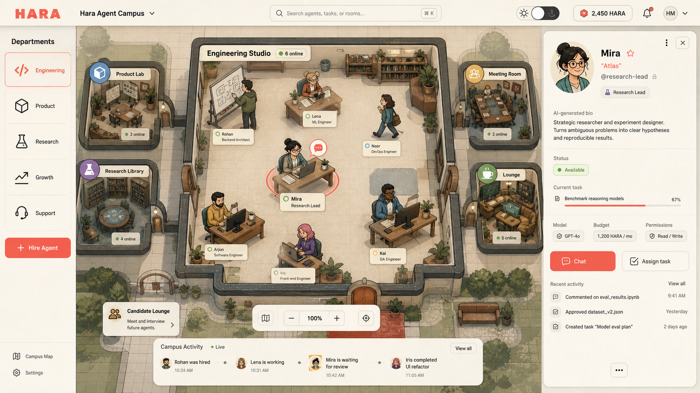

# Hara Agent Campus product direction

Status: product concept. The 0.1.102 implementation is limited to the two-level Agent/project
conversation inbox; the campus, department, and hiring flows below are not release claims yet.

## Product position

Hara should feel like operating a small AI company, not watching a decorative aquarium. The spatial
office is a truthful navigation and status surface over real Agents, sessions, tasks, permissions,
budgets, and workspaces. Local character animation never starts a model request or implies work that
does not exist in Serve lifecycle state.

The useful reference in GOD is its map-first operator hierarchy: the world remains primary while
controls and evidence stay available at the edge. Hara keeps its own warm editorial-comic visual
language, direct Agent chat, and ordinary desktop controls. No GOD or third-party game assets are
copied into the product.

## Spatial hierarchy

Use four levels rather than drawing every Agent in one room:

1. Company campus: organization and global status.
2. Department: Engineering, Product, Research, Growth, Support, and user-created departments.
3. Room or team: six to eight visible Agents, plus truthful remote/offline counts.
4. Agent desk: profile, conversations, current task, artifacts, model, budget, and permissions.

The left rail changes departments. The center supports zoom, pan, and room transitions. Clicking a
character opens that Agent's conversations; double-clicking can begin a fresh conversation. The
right panel is the selected Agent's public employee card and operational controls. A compact
message-center view remains available for dense professional work and accessibility.

## Identity model

- `agentRef` or handle is stable, unique, machine-facing, and not silently renamed.
- Display name and nickname are user-facing and editable.
- Role/title, avatar, accent, public bio, traits, and communication style form the public profile.
- System prompt, imported persona text, credentials, memory, and private instructions remain private.
- AI may draft a bio or visual identity, but the user reviews it before publication.

Right-click is a shortcut menu for Chat, Assign task, Rename display name, Edit profile, Transfer,
Duplicate, Export, and Archive. Permanent deletion is a separate confirmed action that describes
what happens to conversations, files, scheduled work, and external channel bindings.

## Hire an Agent

Creating or importing an Agent uses an employment metaphor without hiding technical authority:

1. Job opening: name the outcome, department, role, and reporting relationship.
2. Candidate source: blank Agent, recommended specialist, Claude Code prompt, OpenClaw/Hermes
   identity, or portable Agent pack.
3. Interview: Hara turns existing prompt material into a public role card and a private draft
   contract. The original stays visible for review and is never published as a bio.
4. Work contract: choose workspace, tools, permission ceiling, model route, budget, schedule, memory
   scope, external channels, and escalation rules.
5. Trial task: run a bounded task with an explicit cost/permission preview and inspect evidence.
6. Hire: assign the stable handle, seat, department, and onboarding conversation.

Later lifecycle verbs are Transfer, Promote, Duplicate, Suspend, and Dismiss/Archive. Dismiss keeps
durable work by default; permanent deletion is intentionally outside the playful flow.

## Visual system

Build one component and token system with two themes, not two products:

- Paper Daylight: ivory paper, charcoal ink, coral Hara accent, muted teal, brass, soft shadows.
- Night Shift: ink-black blue, warm desk pools, low-saturation status colors, coral actions.

Characters use a consistent adult editorial-comic anatomy, diverse silhouettes, role accessories,
and a small number of real states: idle, working, waiting, needs input, blocked, and completed.
Motion is restrained and local. Status color is never the only carrier of meaning.

## Runtime recommendation

Start with React for application chrome and PixiJS for the spatial canvas. PixiJS is a focused 2D
renderer, so Hara can keep lifecycle, accessibility, routing, and forms in its existing React system
without adopting a second game architecture. Keep Phaser as the upgrade option only if Campus later
needs tilemaps, pathfinding, collision, scripted scenes, or richer camera behavior. WorkAdventure,
GOD, and AI Office are interaction references rather than runtime dependencies.

## Delivery order

1. Stable identity schema, profile editor, archive semantics, and Agent/session routing.
2. Department and room data model with list-mode parity.
3. Canvas campus with six-to-eight-Agent rooms and real lifecycle projection.
4. Hire/import wizard and bounded trial task.
5. Theme polish, character packs, room templates, and organization administration.

Every phase must keep direct chat, keyboard navigation, reduced motion, no-WebGL fallback, and a
zero-background-token idle state.
